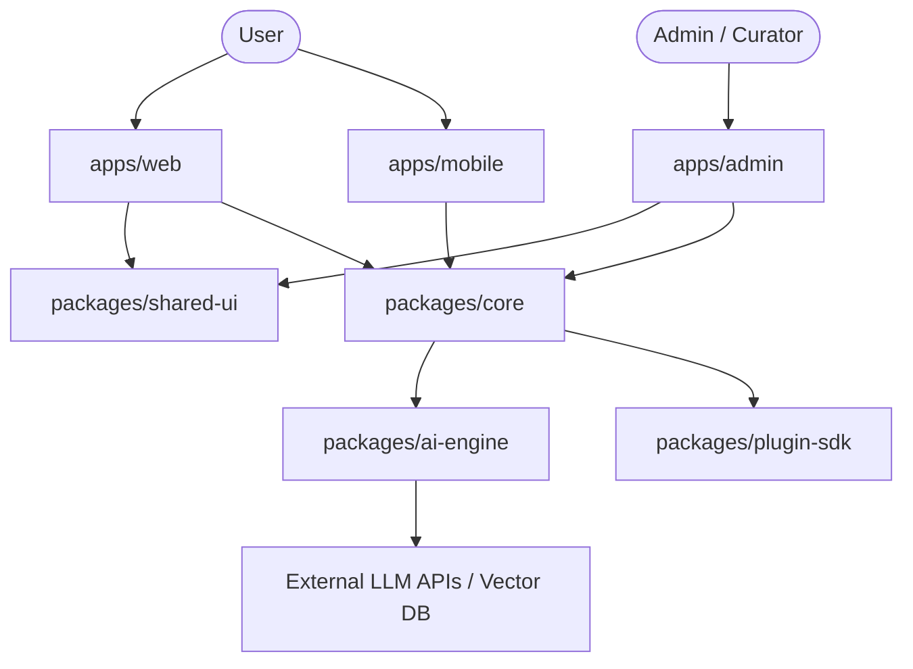

# Architecture Overview

This document outlines the high-level architecture of the **AI Mentor** platform.

## High-Level Data Flow

## Modular Strategy

- **Tight Encapsulation**: Each app contains _only_ runtime-specific dependencies and page-level routes.
- **Isomorphic Core**: Logic in `packages/core` should run on both Node.js serverless/edge functions and within client environments where possible.
- **Design System Isolation**: Components in `packages/shared-ui` must be pure and stateless/declarative, receiving configuration options and events as props.
- **Intelligent AI Orchestration**: All custom prompt templates and vector database schemas are isolated within `packages/ai-engine` to prevent logic leakage into standard frontend applications.
